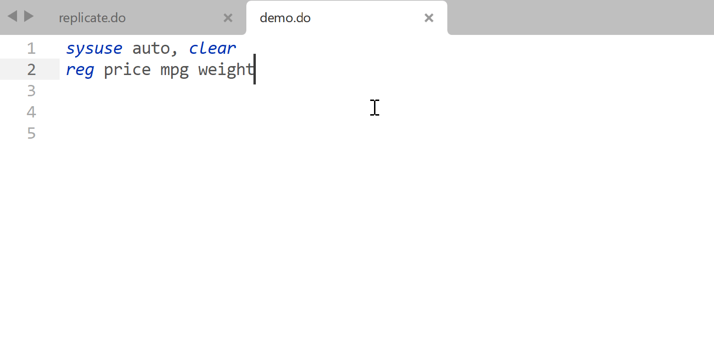

There are a few more steps to get the plugin work. You can find a [video guide](#video-tutorial) from installation to configuration at the bottom of this page.


## Configure StataEditor

There are a few required and optional arguments to be specified. Open Sublime Text > Preferences > Package Settings > StataEditor > Settings – User. An empty file will pop up. You can copy the template setting below, paste it into the empty file, and change the Stata version and path to your own.

```
{
    /* true = Add an empty line at the end of the do file. It's recommended to
       set it to be true, since Stata builtin editor needs an empty line at the
       end of a do file to run properly. (This empty line is automatically done
       in Stata default do file editor so you may not realise it before)
    */
    "ensure_newline_at_eof_on_save": true,

    /* Your Stata `.exe` path */
    "stata_path": "C:/Program Files/Stata17/StataMP-64.exe",

    /* Your Stata version. We only need the integer part. That is, type 16 if
       your Stata version is 16.1
    */
    "stata_version": 17,

    /* Character encoding. "utf-8" is recommended for Stata 15 and later. For
       earlier versions and non-latin environment (e.g. Stata in Chinese or
       Japanese), you may want to use "gbk"
    */
    "character_encoding": "utf-8",

    /* true = enable variable auto-completion */
    "variable_completions": true,

    /* true = enable function auto-completion */
    "function_completions": true,

    /* true = enable command auto-completion */
    "command_completions": true,

    /* The working directory in Stata when you establish an initial Stata
       connection from Sublime Text.
       "current_path" = where your currently opened do file is located
    */
    "default_path": "current_path",

    /* Which types of files should be included in filename auto-completion. Note
       that if your folders containing an huge amount of files, this can lead to
       memory leaks. If so, simply change the setting to "false".
       false = disable such auto-completion
       To enable file completions, enter the file extensions you wish to be
       enabled separated by commas
    */
    "file_completions": "dta, do, py, xlsx, xls, csv, txt",

    /* The waiting time in seconds from that Stata is launched until the
       commands are being sent. With zero waiting time, Stata may be launched
       twice. Only matters for Stata 15 and later. Change waiting time as
       needed. The default 0.5 seconds is often fine
    */
    "waiting_time": 0.5
}
```

!!! example "Example setting"

    To say, I use Stata 16.1, and it's installed in `D:/Economics/Stata16/StataMP-64.exe`. There are thousands of files in my project, so I want to disable file name auto-completion to speed up the plugin.

    ```
    {
        "ensure_newline_at_eof_on_save": true,
        "stata_path": "D:/Economics/Stata16/StataMP-64.exe",
        "stata_version": 16,
        "character_encoding": "utf-8",
        "variable_completions": true,
        "function_completions": true,
        "command_completions": true,
        "default_path": "current_path",
        "file_completions": false,
        "waiting_time": 0.5
    }
    ```


## Register the Stata Automation Type Library

To allow Sublime Text to talk with Stata, we need to use [a Stata Automation object](https://www.stata.com/automation/). You may refer to the [official guide](https://www.stata.com/automation/#install), or in short:

1. Press ++win+r++, type `cmd`, and then press ++ctrl+shift+enter++ to run Command shell **as Administrator**. You will see a window with prompt like `C:\WINDOWS\system32>`
1. Go to Stata installation directory using `cd`. E.g., if your Stata in in `C:/Program Files/Stata17`, then type `cd "C:/Program Files/Stata17"` and press ++enter++. The quotes are necessary if the path includes whitespace. After this step, the prompt will change to `C:\Program Files\Stata17>`
1. Type `./StataMP-64.exe /Register` and press ++enter++ to register. If you use Stata SE or other version then change the executable filename accordingly
1. Nothing fancy will happen but it's already properly registered


!!! bug "CMD, PowerShell, Terminal?"

    Newer Windows comes with more than one command-line shells, including Command Prompt, Terminal or PowerShell. The above steps may or may not work. Whenever possible, use Command shell (cmd).


!!! warning "Need admin rights"

    We must run `./StataMP-64.exe /Register` as admin. If you see errors like `AttributeError: 'module' object has no attribute 'stata'` in Sublime Text console, please re-register Stata library as admin. See [#1](https://github.com/harningle/StataEditor/issues/1) for more details.


Close and restart Sublime Text. Now we are ready to [start](using.md)!


## Copilot (optional)

[GitHub Copilot](https://github.com/features/copilot/) uses [Codex](https://openai.com/blog/openai-codex), which is a descendant of GPT-3 by OpenAI, the company that created ChatGPT, to suggest code in near real-time. Basically, you write the comment or part of the code, and Copilot auto-complete the rest for you. It's a great tool to boost productivity! There is no official support of Copilot for Sublime Text, but community members have made it possible. One such tool is [LSP-copilot](https://packagecontrol.io/packages/LSP-copilot). You can find the installation and setup instruction on [its repository](https://github.com/TerminalFi/LSP-copilot).

!!!warning "Copilot may not work well with Stata"

    Personally I discourage using Copilot for Stata. The reason is simple: Copilot does not understand Stata syntax well, partly due to a lack of Stata code in its training data. (Just think about how many CS papers publish their code on GitHub, and how many econ papers have their replication files available online...) As a result, it may suggest wrong code very often. Below is an example where Copilot is wrong (the coefficients are completely [hallucination](https://dl.acm.org/doi/10.1145/3571730)).
    
    


## Video Tutorial

<div style="position: relative; width: 100%; padding-bottom: 56.25%;">
    <iframe src="https://onedrive.live.com/embed?cid=56B137D063F1703D&resid=56B137D063F1703D%211182&authkey=ABeldzZWQIj9th0" style="position: absolute; top: 0; left: 0; width: 100%; height: 100%;" frameborder="0" scrolling="no" allowfullscreen title="Install"></iframe>
</div>
