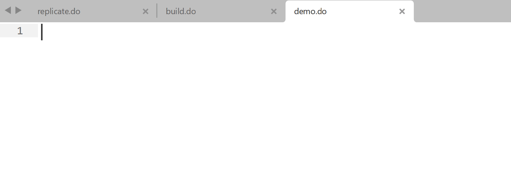
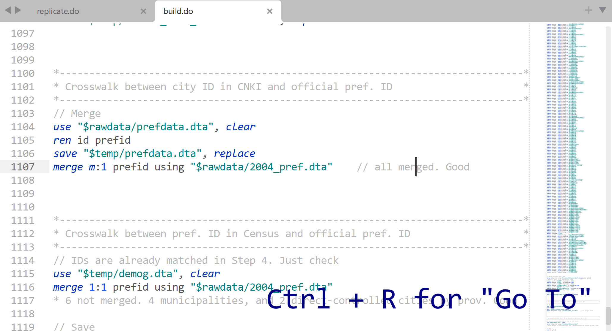
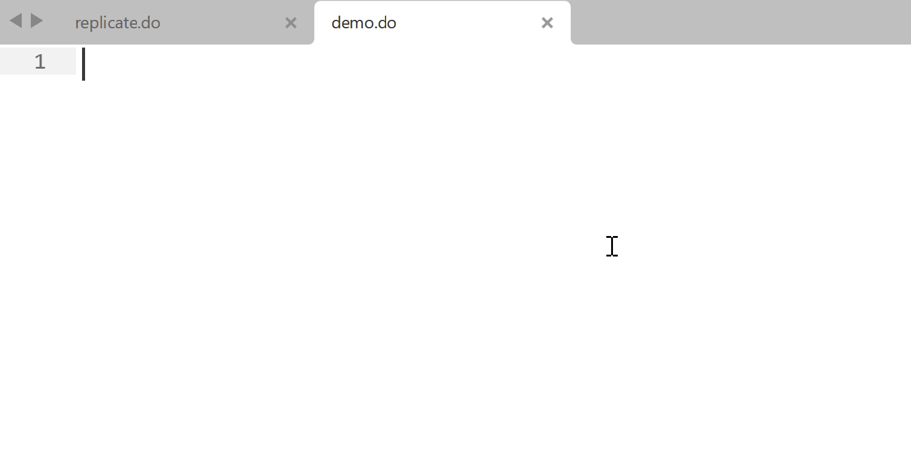

# StataEditor for Sublime Text 3/4

    <a href="https://harningle.github.io/StataEditor/using/#video-demo"><strong>🖥️ Demo</strong></a> | 
    <a href="https://harningle.github.io/StataEditor/config/#video-tutorial"><strong>🔍 Installation Guide</strong></a>

    
    
    

A Sublime Text plugin for Stata. Based on original work by [Mattias Nordin](http://mattiasnordin.com) and [Sergio Correia](http://scorreia.com/)!

## Features

This plugin enables us to run Stata code from Sublime Text 3/4, with the following features:

* Syntax highlighting
* Use "GoTo Symbol" to navigate through the do files
* Code snippets for frequently used commands
* And ALL the features coming with Sublime Text and other plugins!
* (, which includes Copilot :rofl:)

## Installation and Configuration

Install from this repository via [Package Control](https://stackoverflow.com/a/44441455), and set your Stata installation directory in user settings.

## Using StataEditor

[Read more](using.md) about the features, keyboard shortcuts and code snippets. A video demo for doing summary statistics, scatter plot, and regression [here](using.md#video-demo).
