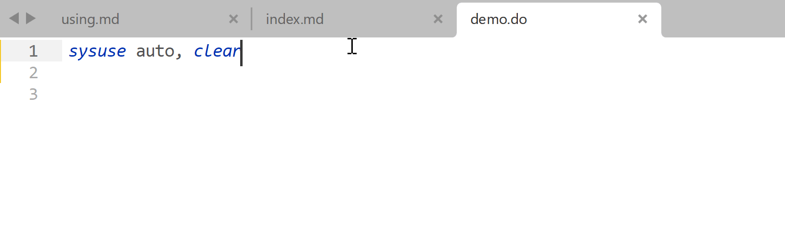

# StataEditor for Sublime Text 3/4

Based on original work by [Mattias Nordin](http://mattiasnordin.com) and [Sergio Correia](http://scorreia.com/)!

## Features

This plugin enables us to run Stata code from Sublime Text 3/4, with the following features:

* Syntax highlighting
* Run only (partly) selected code
* Use "Go To Symbol" to navigate through the do files
* Code snippets that I found useful
* And ALL the features coming with Sublime Text and *other* plugins!
* (, which includes Copilot :rofl:)

## Installation

Install from this repo. via [Package Control](https://stackoverflow.com/a/44441455).

## Configuration and Usage

In progress...
